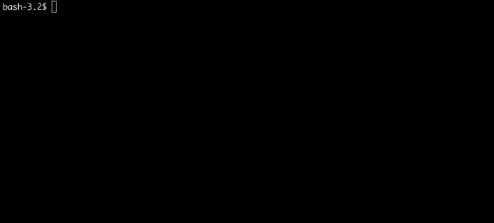

# `@fenwik/togglinear`

Start [Toggl Track](https://toggl.com/track/) time entry from your [Linear](https://linear.app/) task list.

## Installation

Use [npm](https://www.npmjs.com/) or [yarn](https://yarnpkg.com/) to install.

    $ npm install -g @fenwik/togglinear
or

    $ yarn global add @fenwik/togglinear

## Usage

Use `togglinear` CLI command.

    $ togglinear

When running for the first time, you will need to enter your Linear API key and Toggl API Token.

You can start Linear task by ID

    $ togglinear BAR-123

To reset config run:

    $ togglinear --reset-config

To reset projects mapping run:

    $ togglinear --reset-projects-mapping

## License

MIT
